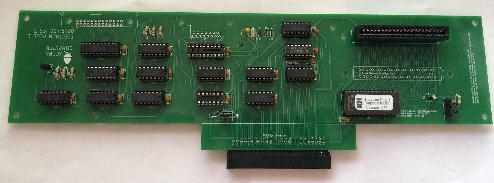

# Acorn Plus 1 Reimagine
Recreation of the Acorn Plus 1 based off of original schematic and redrawn schematic

Goal was to recreate as much as possible the schematic and design of the original PCB and to use descrit components.

Issues sourcing components as some are no longer made. Cost to make is >£100, PCB's £11 each PCBway used to make boards

## First version created June 2023.
Using original schematic from Acorn and redrawn schematic by P.Harvey

Points to note, redrawn schematic has -5V going to Analogue port should be +5V

Pin 2 of IC6 needs connecting to Pin 3 of IC8.

Also used the excellent work of myelin and his KiCad files for the connectors

https://github.com/myelin/myelin-kicad.pretty

## Other issues to correct:-

IC6 needs moving 1.2mm up so AP6 board will fit.

Two holes missing one mounting hole and one hole by lower edge connector.

Resistor size chosen a bit small just fits.

Left analogue hole needs to be moved 2mm as doesnt align with lower case.

IC8 Ground connection on back needs increasing 1mm.

Recheck layout and tidy up visual issues.
